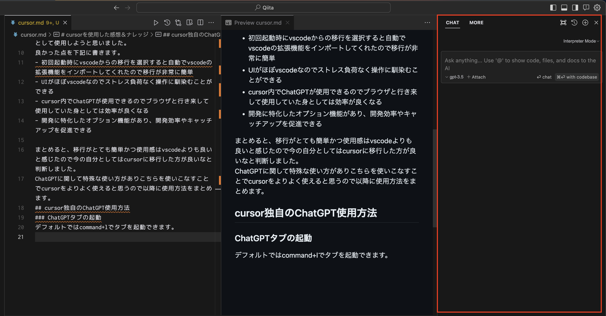
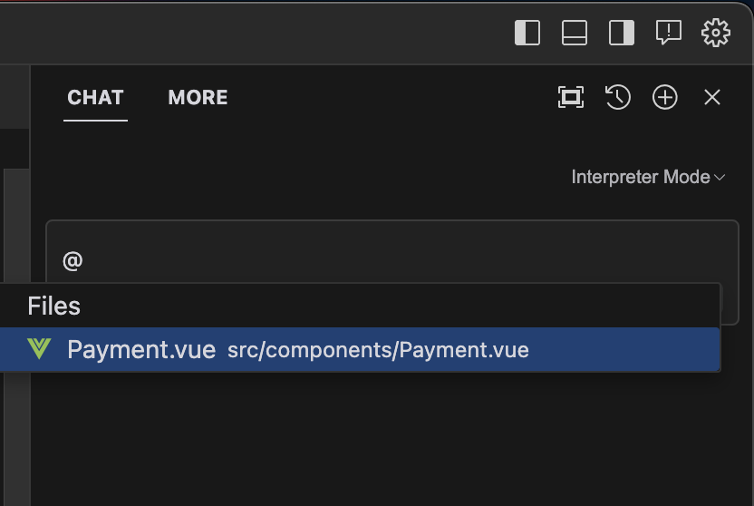
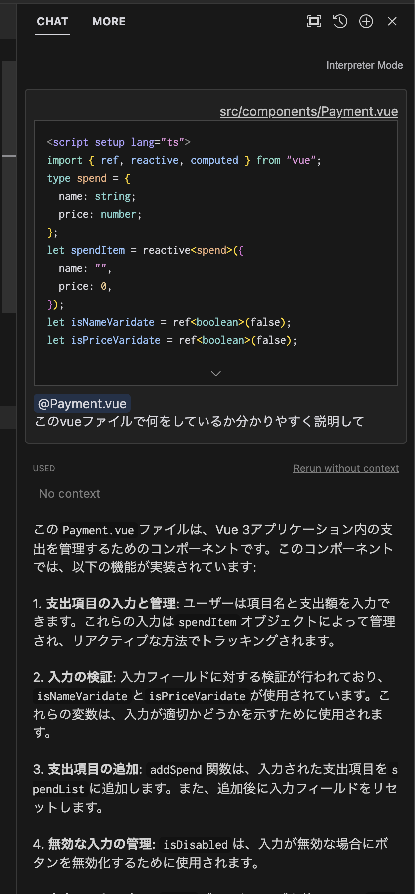
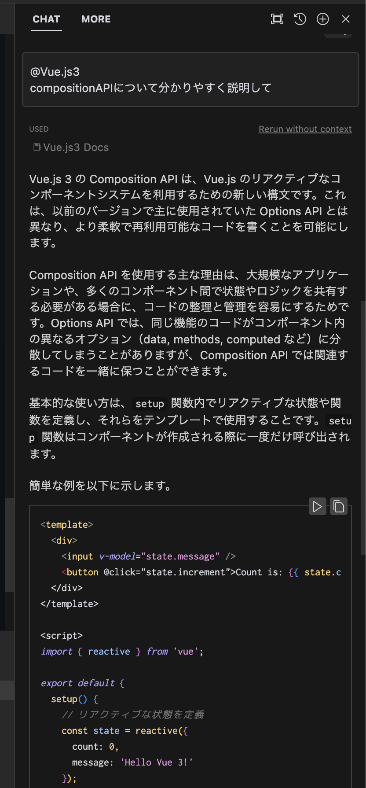
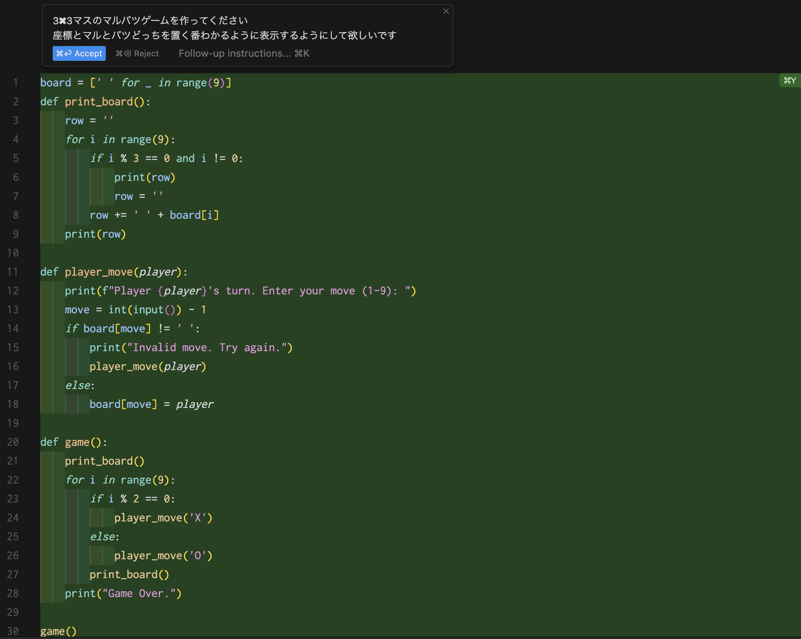
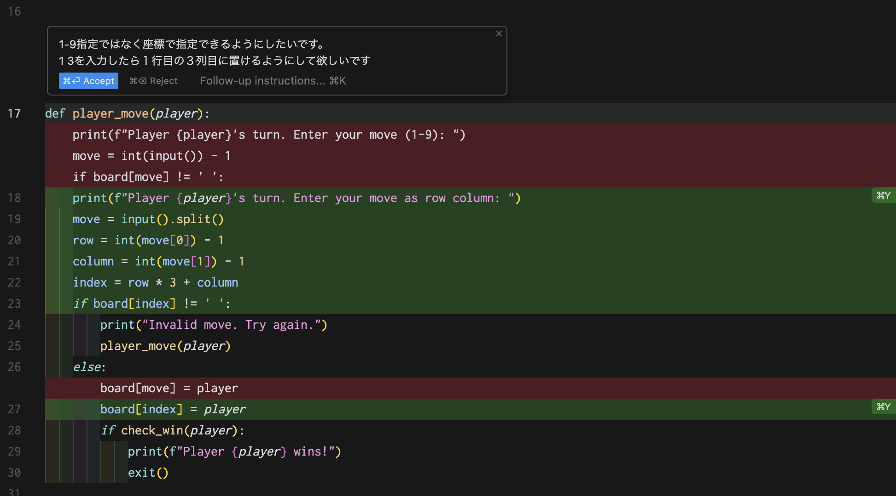
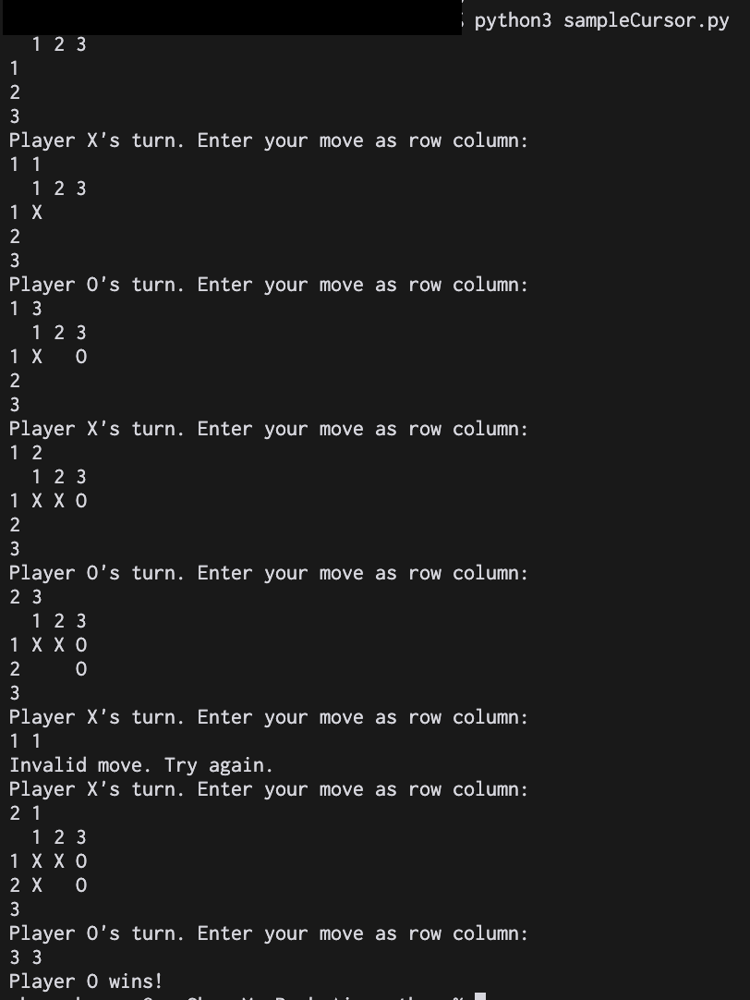

# cursorを使用した感想と操作方法のナレッジ共有
## はじめに
最近「[cursor](https://cursor.sh/)」というエディタが話題になっており、巷ではvscodeよりも良い？等聞くことがあったので実際に使ってみて操作方法や感想を共有できたらと思い記事にあげることにしました。
## cursorとは(ざっくり)
- AIファーストの開発に特化したコードエディタ
- chatGPTを活用してコードの自動生成やバグ修正をサポートしてくれる機能がある。
- vscodeをフォークして開発されたのでvscodeからの移行がしやすい
## 結論(感想)
非常に使い勝手が良かったので、しばらくはメインのエディタとして使用しようと思いました。  
良かった点を下記に書きます。
- 初回起動時にvscodeからの移行を選択すると自動でvscodeの拡張機能をインポートしてくれたので移行が非常に簡単
- UIがほぼvscodeなのでストレス負荷なく操作に馴染むことができる
- cursor内でChatGPTが使用できるのでブラウザと行き来して使用していた身としては効率良くコーディングができる
- 開発に特化したオプション機能があり、開発効率やキャッチアップを促進できる

まとめると、移行がとても簡単かつ使用感はvscodeよりも良いと感じたので今の自分としてはcursorに移行した方が良いなと判断しました。  
ChatGPTに関して特殊な使い方があり、こちらを使いこなすことでcursorをより便利に使用できると思うので以降に使用方法をまとめました。  
※内容に誤りがありましたら申し訳ないです。。。
## cursor独自のChatGPT使用方法
### ChatGPTタブの起動
デフォルトではcommand+lでタブ(赤枠)を起動できます。  
コーディングに関係ない質問でも対話可能です。  
  
### @&#xFFF0;Files
cursorのChatGPTでは「@&#xFFF0;(オプション)」をつけることでオプションにあった解釈をしてくれる機能があります。  
@&#xFFF0;Filesをつけるとワークスペース内のファイルを選択することができ、選択したファイルを理解した上で質問することができます。  
試しにVueの学習で作成した簡単な支出計算のvueファイルを読み込ませて質問してみます。  

「@&#xFFF0;」を入力すると候補が出るので、「@&#xFFF0;Files」を選択します。  
次にファイルの候補が出るので読み込ませたいファイルを選択します。 
  

読み込ませたら質問したい内容を入力してEnterを押下します。  
今回は何をしているか説明してと入力すると、Vue3で支出を管理するコンポーネントという説明と実際にどういう機能があるかを説明してくれました。  
どんな処理を実装したか明確に覚えていないのですが、回答は概ね正しいと思います。キャッチアップには非常に便利だと思いました。
  
### @&#xFFF0;Docs
ドキュメントを読み込ませて対話することができます。この機能が非常に評判が良いと聞きます。  
自分で任意のドキュメントを指定することができるので新しい機能がリリースされた時にドキュメントを読み込ませて要約してもらうという使い方が有用だと思います。  
試しにvue3のドキュメントを選択してcompositionAPIについて説明してもらいました。  

  

質問が大雑把でしたが、大枠の説明としては十分だと思います。記述例もあるので追加質問を繰り返すことで一通り理解できるところまで持っていけそうな所感でした。  

### with codebase
質問をするときにEnterでなくcommand+Enterで投げるとワークスペース全体のファイルを理解した上で回答してくれます。  
プロジェクトがどういう構成になっているかを知りたいときはwith codebaseで質問をすると良さそうです。  

### チャット
エディタ上でcommand+kを押すとチャット機能を起動することができます。  
〇〇を書いてというと自動でコーディングをしてくれてcommand+yで反映command+nで非反映することができます。  
試しにpythonで⚪︎×ゲームを作ってもらいました。  

command+kを押すと上部にあるようにテキストボックスが表示されます。  
沢山誤字をしていますが、ある程度汲み取って書いてくれました。
  

気になる部分を選択して再度チャット機能で命令すると選択部分にフォーカスして修正してくれます。  
見慣れた差分表示で理解しやすいです。

何回か修正をしてもらって動作確認したら上手く実装できていました。  
自分は全くコードに触れていなく、全てチャット機能で書いてもらって作成できました。  
  

### 自動デバック
ターミナル上で実行してエラーになると「自動デバック」ボタンが表示されてエラーを修正してくれるみたいです。  
自分は設定がうまくできず表示されない状況なのでこの機能はまだ試せてはいないです。  

### lintエラー修正
lintエラーにカーソルを当ててfixの文言が書かれたボタンを押下するとエラー解消方法の質問を投げてくれます。  

## まとめ
まだ自分が知らないまたは試せていない機能もありますが、触れた範囲でもかなり使用勝手が良かったのでこれからも活用したいと感じました。  
